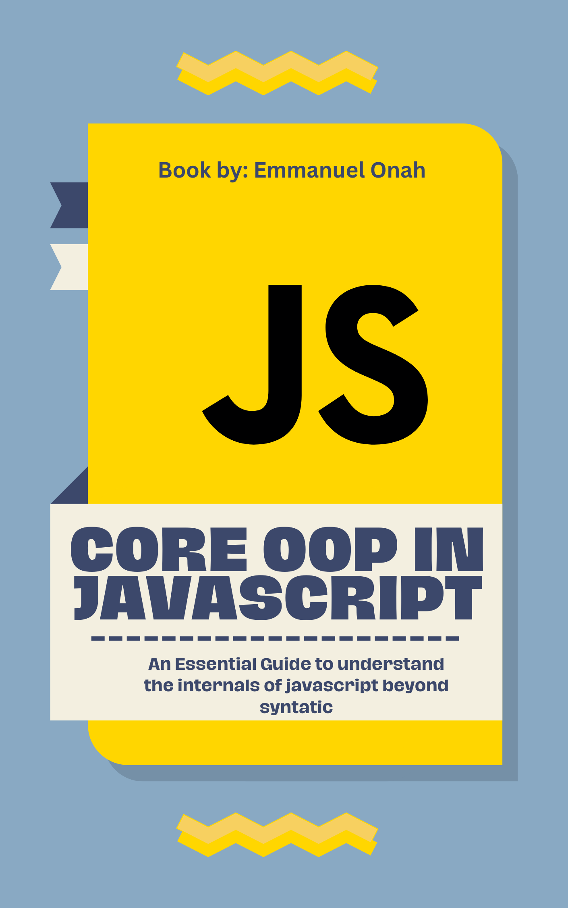

# Core OOP in JavaScript - 1st Edition

This eBook dive deep into JavaScript es5 Object Oriented Programming(i.e before the invention of the es6 syntactic "class"), this will help you understand the internal mechanism of everything being an object in JavaScript. This is the **first edition** of the eBook:

&nbsp;&nbsp;

**To read more about the motivations and perspective behind this eBook, check out the [Preface](preface.md).**

## Table of content

* [Introduction](./introduction/README.md)
* [Constructor](./constructor/README.md)
* [Instantiation](./instantiation/README.md)
* [Four Pillars of OOP](./pillars-of-oop/README.md)
* [Bonus](./bonus/README.md)

## Contributions

Please feel free to contribute to the quality of this content by submitting PRs for improvements to code snippets, explanations, etc.

Any contributions you make to this effort **are of course greatly appreciated**.

But **PLEASE** read the [Contributions Guidelines](CONTRIBUTING.md) carefully before submitting a PR.

----

## License & Copyright

&nbsp;&nbsp;

The materials herein are all &copy; 2021 - 2023 Emmanuel Onah.

 This work is licensed under a <a rel="license" href="http://creativecommons.org/licenses/by-nc-nd/4.0/">Creative Commons Attribution-NonCommercial-NoDerivs 4.0 Unported License</a>.
